# лаба по питону

## содержание

* [1 задание](#1-задание)
* [2 задание](#2-задание)
* [3 задание](#3-задание)
* [4 задание](#4-задание)
* [5 задание](#5-задание)
* [6 задание](#6-задание)
* [7 задание](#7-задание)
* [8 задание](#8-задание)

## 1 задание

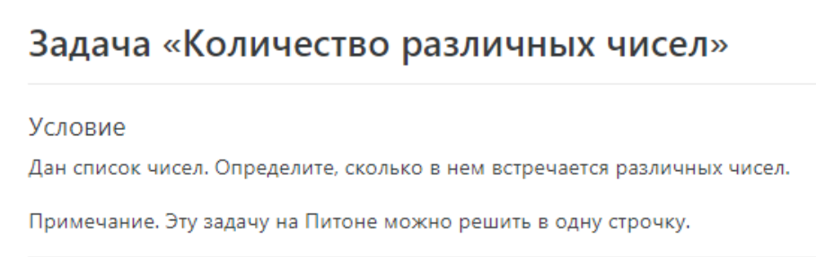

результат выполнения скрипта

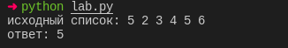

## 2 задание

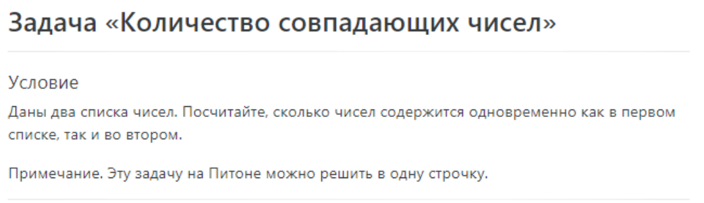

результат выполнения скрипта

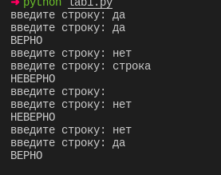

## 3 задание

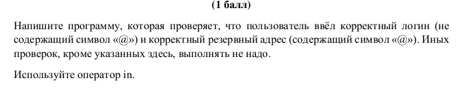

результат выполнения скрипта

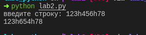

## 4 задание

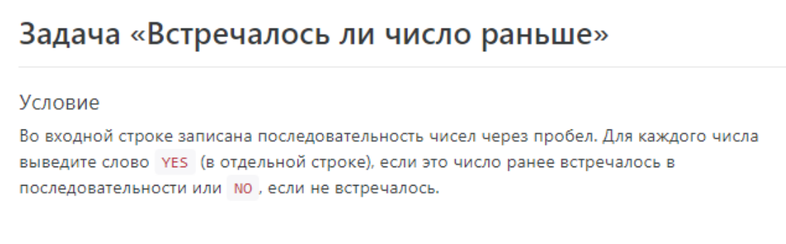

результат выполнения скрипта

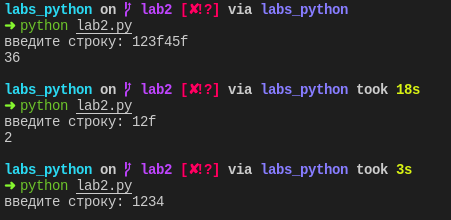

## 5 задание

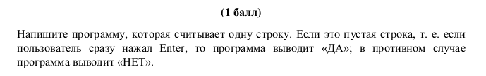

результат выполнения скрипта

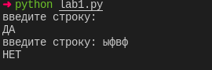

## 6 задание

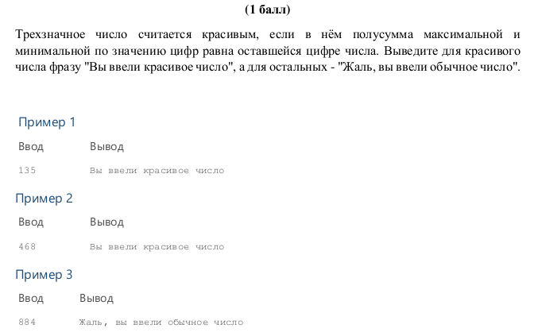

результат выполнения скрипта

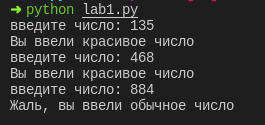

## 7 задание

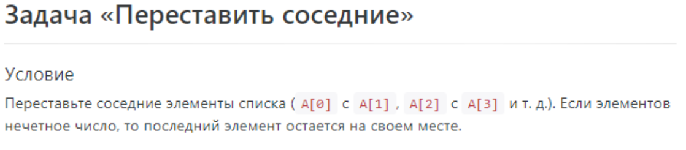

результат выполнения скрипта

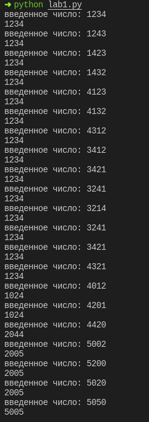

## 8 задание

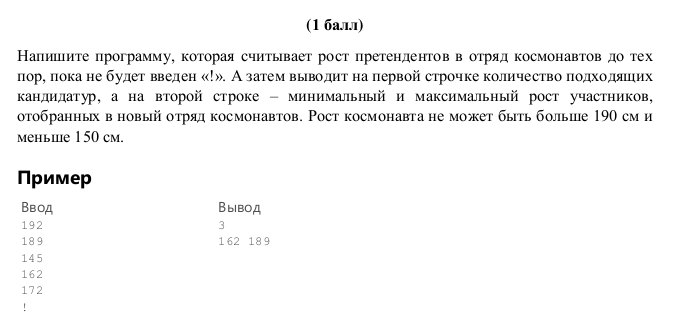

результат выполнения скрипта

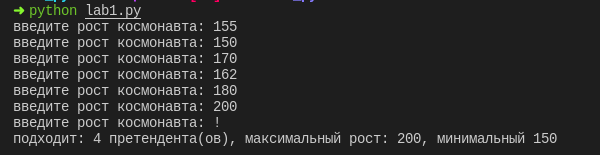
