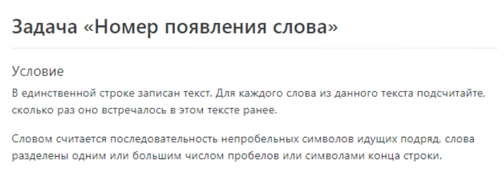
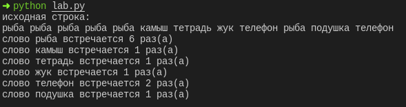
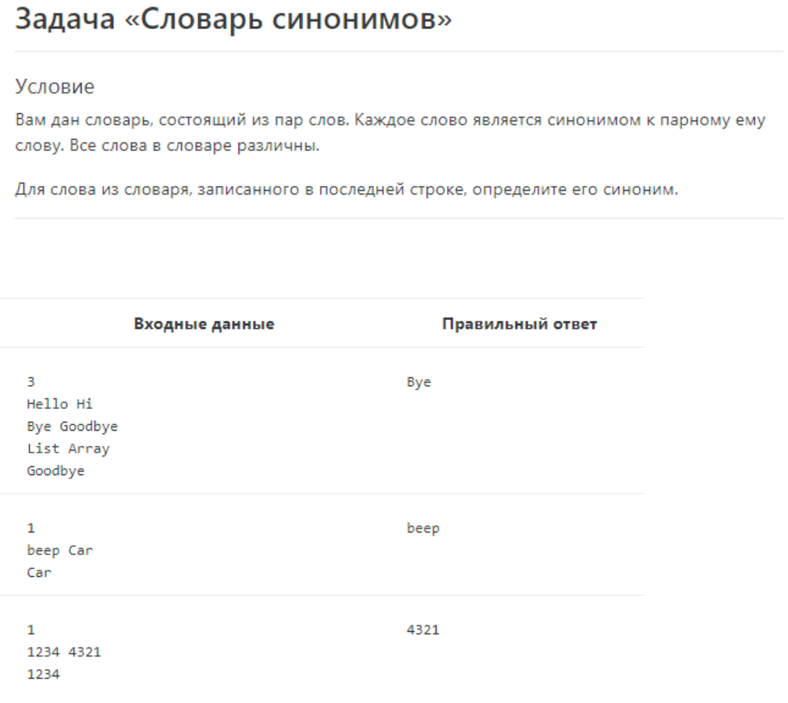
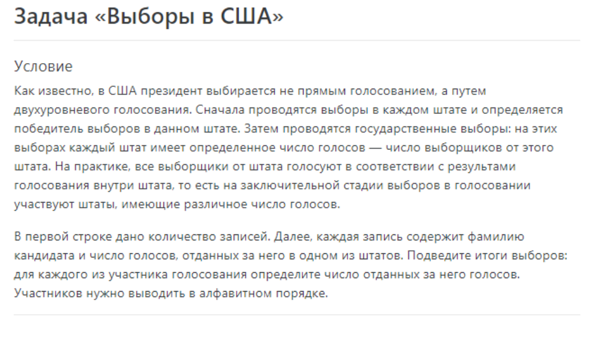

# 1 лаба по питону

## содержание

* [1 задание](#1-задание)
* [2 задание](#2-задание)
* [3 задание](#3-задание)
* [4 задание](#4-задание)
* [5 задание](#5-задание)
* [6 задание](#6-задание)
* [7 задание](#7-задание)
* [8 задание](#8-задание)
* [9 задание](#9-задание)
* [10 задание](#10-задание)
* [11 задание](#11-задание)
* [12 задание](#12-задание)
* [13 задание](#13-задание)

## 1 задание

результат выполнения скрипта

## 2 задание

результат выполнения скрипта

## 3 задание

результат выполнения скрипта

## 4 задание

результат выполнения скрипта

## 5 задание

результат выполнения скрипта

## 6 задание

результат выполнения скрипта

## 7 задание

результат выполнения скрипта

## 8 задание

результат выполнения скрипта

## 9 задание

результат выполнения скрипта

## 10 задание

результат выполнения скрипта

## 11 задание

результат выполнения скрипта

## 12 задание

результат выполнения скрипта

## 13 задание

результат выполнения скрипта

